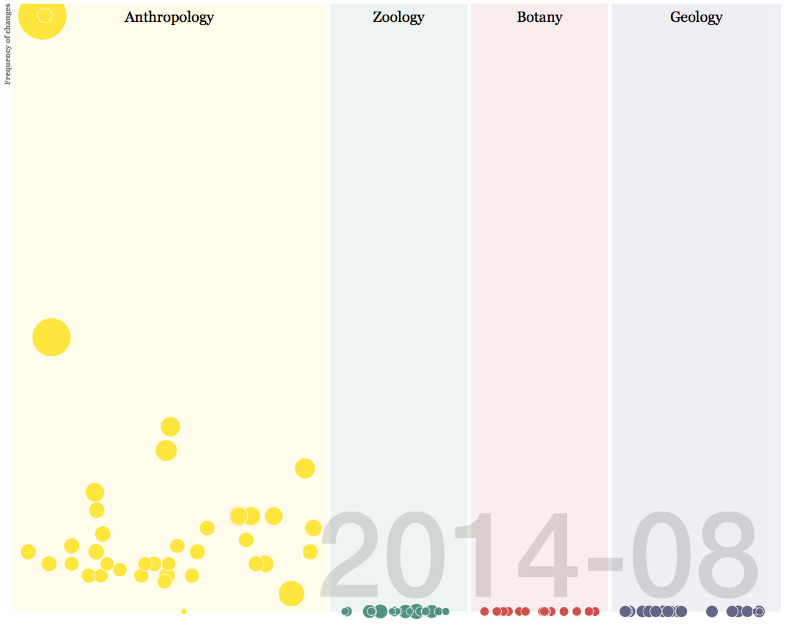

# IVMOOC 2015 FMNH Documentation
The Field Museum Collections Database Visualization

This repository contains the complete documentation for EMuView, a visualization project for The Field Museum of Natural History. The project was undertaken as part of <a href="http://ivmooc.cns.iu.edu">IVMOOC 2015</a>, a data visualization course based at Indiana University, Bloomington. 

Updated demo, with context and legend [www.zenoeffect.net/FMNH/](http://zenoeffect.net/FMNH/)  
Orginal demo updated (code in d3Demo folder) [ella.ils.indiana.edu/~kadur/IVMOOCFinal](http://ella.ils.indiana.edu/~kadur/IVMOOCFinal)   
Report produced for the course [rshigginsl.net/FMNH/Report.pdf](http://www.rshiggins.net/FMNH/Report.pdf)

      

Originally designed and built by Kartik Adur, Richard Higgins, Jingsha Luo,	Joshua Quick,	Wensi Wang. Revisions by Kartik and Richard. Licensed under a <a rel="license" href="http://creativecommons.org/licenses/by-nc/4.0/">Creative Commons Attribution-NonCommercial 4.0 International License</a>.

The Field Museum asserts its rights on all data associated with this project. The data is available ONLY for not-for-profit scientific use with the stipulation that FMNH be clearly identified as the source of the data. FMNH requests copies or reprints of publications that are based on their collections.  

 
